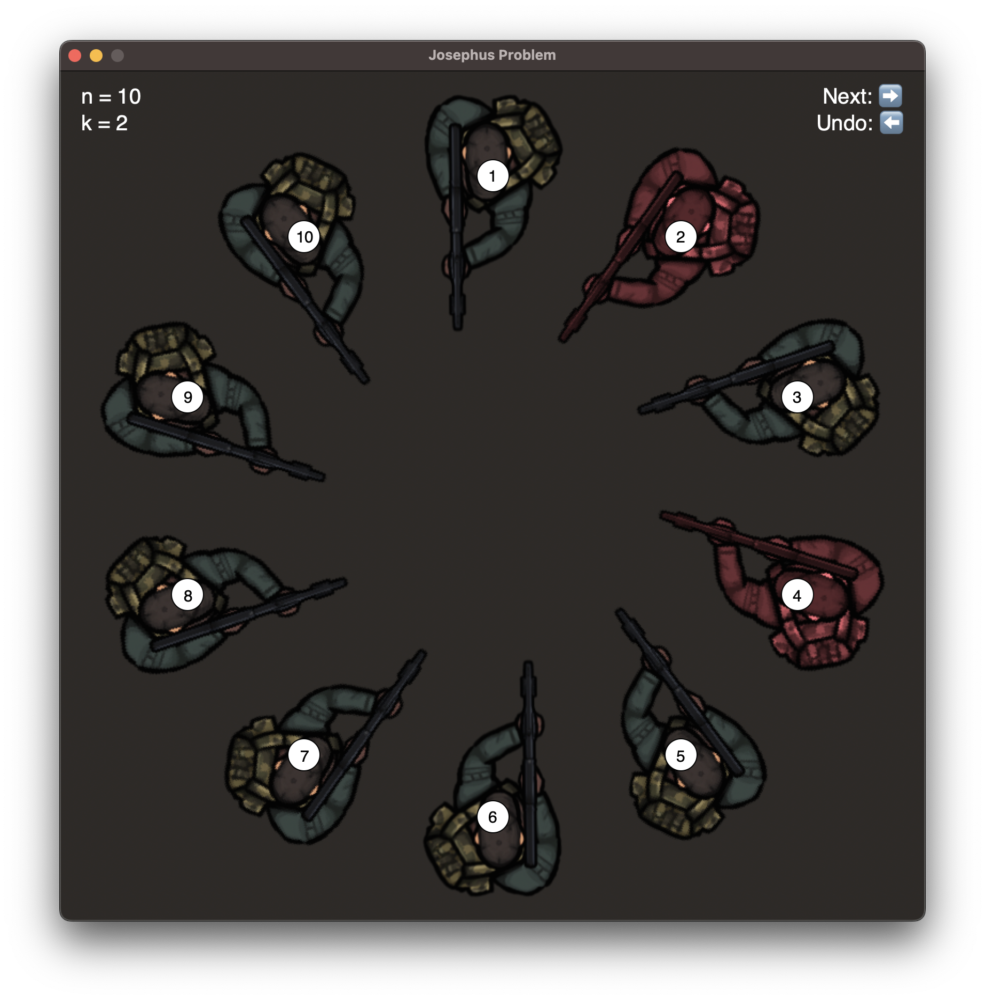

# Josephus Visualizer
This is a simple gui visualizer for the Josephus problem.

## How to use
1. Clone the repository
2. Install the requirements: `pip install -r requirements.txt`
3. Run the program: `python main.py`
4. Enter the number of people and steps of killing

## Sample
This is sample for 10 people and 2 steps of killing
